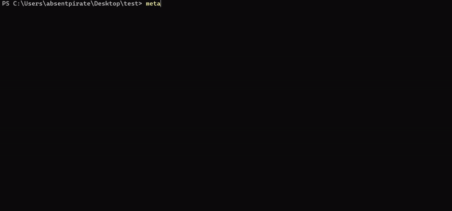
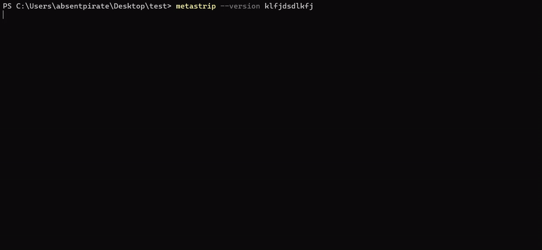

# metastrip


**metastrip** is a command-line tool, written in C from scratch, for inspecting the metadata segments hidden inside JPEG files — EXIF, XMP, ICC color profiles, comments, and raw APP0–APP15 marker segments — without needing a GUI or a heavyweight library.

> **Note:** this is version `1.0.0` and covers metadata **viewing** (`show`) only. Stripping/removing metadata is planned for a future release.

---

## See it in action

**Inspecting a JPEG's metadata:**



**Built-in input validation (rejects bad input before touching a file):**



---

## Features

- View **every** metadata segment in a JPEG at once, or filter down to exactly what you want
- Target segments either by **JPEG marker number** (`app0` … `app15`, `com`) or by **content identifier** (`exif`, `xmp`, `icc`, `iptc`) — metastrip reads the actual payload signature to tell apart, for example, the two different things that can live inside an `APP1` segment (EXIF vs. XMP)
- Detect **trailing data** appended after the end of the actual image stream
- Combine multiple targets in a single command (`app0,com,exif`)
- Input validation that catches invalid targets, duplicate targets, and malformed combinations *before* ever opening your file
- Zero external dependencies — pure C, standard library only

---

## Prerequisites

You need a **C compiler** installed. That's it — no other libraries or dependencies are required.

- **Windows:** [MinGW-w64](https://www.mingw-w64.org/) (provides `gcc`), or the compiler bundled with [MSYS2](https://www.msys2.org/)
- **Linux:** `gcc` (usually already installed, or `sudo apt install build-essential` / your distro's equivalent)
- **macOS:** Xcode Command Line Tools (`xcode-select --install`), which provides `clang`/`gcc`

Check you have one available:

```bash
gcc --version
```

---

## Installation

metastrip ships as source — **you compile it yourself**, there's no prebuilt binary to download.

### 1. Clone the repository

```bash
git clone git@github.com:zyan-007/metastrip.git
cd metastrip
```

### 2. Compile it

```bash
gcc main.c -o metastrip
```

On Windows this produces `metastrip.exe`; on Linux/macOS it produces `metastrip` (no extension). This step needs to be repeated any time `main.c` changes — see below for how to avoid retyping the full path every time you run it.

### 3. Run it

From inside the project folder:

```bash
# Windows
.\metastrip.exe show all photo.jpg

# Linux / macOS
./metastrip show all photo.jpg
```

---

## Running it from anywhere (without recompiling every time)

Once you've compiled the binary, you don't need to rebuild it again just to use it from a different folder — you only need the compiler when the *source code* changes. To be able to type `metastrip` from **any** directory, add the folder containing the compiled binary to your system's `PATH`.

### Windows — temporary (current terminal session only)

Good for quickly trying it out without touching your permanent settings:

```powershell
$env:PATH += ";C:\path\to\metastrip"
```

This only lasts until you close that terminal window.

### Windows — permanent

1. Press `Win`, search **"Environment Variables"**, open **"Edit the system environment variables"**
2. Click **Environment Variables…**
3. Under **User variables** (or **System variables** to make it available to all users), select `Path` → **Edit** → **New**
4. Add the full folder path, e.g. `C:\path\to\metastrip`
5. Click OK on every dialog, then **open a new terminal window** for the change to take effect

### Linux / macOS — temporary (current shell session only)

```bash
export PATH="$PATH:/path/to/metastrip"
```

### Linux / macOS — permanent

Add the same `export` line above to your shell's config file (`~/.bashrc`, `~/.zshrc`, etc.), then reload it:

```bash
source ~/.bashrc   # or ~/.zshrc, depending on your shell
```

Once set up, you can run `metastrip <command>` from any directory, on any file, without `cd`-ing into the project folder or recompiling.

---

## Usage

```
metastrip show <file>
metastrip show <target> <file>
metastrip -h | --help
metastrip -v | --version
```

- `metastrip show <file>` — shows **all** metadata segments found in the file (equivalent to explicitly passing `all` as the target)
- `metastrip show <target> <file>` — shows only the segment(s) matching `<target>`
- `<target>` can be a **comma-separated list** of multiple targets, e.g. `app0,com,exif`

### Targets

| Target             | Matches                                                                 |
|--------------------|--------------------------------------------------------------------------|
| `all`              | Every segment in the file (cannot be combined with any other target)     |
| `app0` … `app15`   | A specific APP marker segment, by its raw marker number                  |
| `com`              | The comment (COM) segment                                                |
| `trailing`         | Any data found appended after the end of the actual image stream         |
| `exif`             | The EXIF data segment, identified by its payload signature (not just its marker number) |
| `xmp`              | The XMP data segment, identified by its payload signature                |
| `icc`              | The embedded ICC color profile, identified by its payload signature      |
| `iptc`             | IPTC metadata, identified by its payload signature                       |

> **Note:** EXIF, XMP, the ICC profile, and IPTC data are matched by reading the actual bytes at the start of the payload — not just by which `APPn` slot they happen to sit in. This matters because a single marker number can hold more than one kind of data (for example, `APP1` is used by both EXIF and XMP, and `APP2` can hold more than just an ICC profile), so metastrip peeks at the payload itself to tell them apart correctly.

### Validation rules

- `all` cannot be combined with any other target — `show all,app0` is rejected
- The same target cannot be repeated — `show app0,app0` is rejected
- An unrecognized target, or an out-of-range app number (e.g. `app16`), is rejected before the file is even opened
- Requesting a broader target automatically covers the more specific targets nested inside it, so you won't get contradictory or duplicate output — e.g. `app1` covers `exif`/`xmp`, `app2` covers `icc`, `app13` covers `iptc`

### Examples

```bash
# Show everything found in the file
metastrip show photo.jpg

# Show only EXIF data
metastrip show exif photo.jpg

# Show a specific APP segment by number
metastrip show app3 photo.jpg

# Show multiple targets at once
metastrip show app0,com,trailing photo.jpg

# Show EXIF, XMP, and the ICC profile together
metastrip show exif,xmp,icc photo.jpg

# Redirect output to a file
metastrip show exif photo.jpg > metadata.txt
```

---

## Current limitations

- **JPEG files only.** metastrip currently only understands the JPEG file structure (`FF D8` header, `FFxx` marker segments). Other image formats (PNG, TIFF, HEIC, etc.) are not supported.
- EXIF, XMP, ICC, and IPTC data are currently extracted as **raw payload bytes** (printable characters shown as-is, everything else shown as `.`), written to disk for you to inspect — metastrip does not yet decode the internal structure of EXIF (its TIFF/IFD tag tree) or parse XML from XMP into individual fields.
- Metadata **removal** is not part of this version.

---

## License

Released under the [MIT License](LICENSE).
